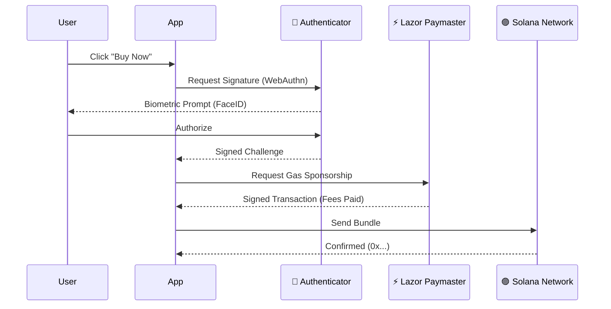

# ⚡ LazorKit Turbo
> **The Ultimate Interactive Starter Kit for Passkey-Native Solana Apps.**  
> *Build Gasless, Seedless, and Smart Wallet experiences in minutes.*

[](https://vercel.com/new/clone?repository-url=https%3A%2F%2Fgithub.com%2FYOUR_USERNAME%2Flazorkit-turbo)
[](https://opensource.org/licenses/MIT)
[](https://lazor.sh)

---

## 🚀 Why LazorKit Turbo?

Integrating Passkeys and Account Abstraction is hard.  
**LazorKit Turbo** makes it easy. 

It's not just a demo template. It's an **Interactive Learning Environment** designed to help developers understand the *LazorKit SDK* by seeing it in action and inspecting the code in real-time.

### ✨ Killer Features

| Feature | Description |
|---------|-------------|
| **🔐 Passkey Auth** | Seamless login with FaceID / TouchID. No seed phrases. |
| **⚡ Gasless Transactions** | Users pay 0 SOL. Fees are sponsored by the Paymaster. |
| **🛠 Interactive Code Mode** | **Exclusive Feature:** Click any UI element to see the exact code that powers it. |
| **🔬 Live Simulation** | Visual debugger that shows the execution flow step-by-step. |
| **🧩 Dependency Graph** | Visual map of the Next.js project structure. |

---

## 🏗 Architecture Flow

How a Gasless Transaction works in LazorKit Turbo:



---

## 🛠 Getting Started

Go from Zero to Hero in less than 2 minutes.

### 1. Clone the Repo

```bash
git clone https://github.com/YOUR_USERNAME/lazorkit-turbo.git
cd lazorkit-turbo
```

### 2. Install Dependencies

```bash
npm install
```

### 3. Run Development Server

```bash
# Requires HTTPS for Passkeys!
# We recommend using ngrok for local development
ngrok http 3000
```

Open the `https://....ngrok-free.app` link on your phone or desktop.

> **Note:** WebAuthn (FaceID) requires a secure context (HTTPS) or `localhost`. It will not work on `http://192.168.x.x`.

---

## 📚 Interactive Tutorials

Don't just read docs. **Experience them.**
Turn on **DEV MODE** (top right switch) in the app to access these guides:

### 1. Wallet Connection
Learn how to wrap your app with `LazorKitProvider` and implement the `useWallet` hook for biometric authentication.

### 2. Gasless Transactions
See how to send SPL transfers where the merchant pays the network fee, creating a true "Web2-like" payment experience.

### 3. Recurring Payments (SaaS)
Implement a subscription model where users sign a transaction once to authorize payments.

---

## 🔧 Troubleshooting

If you encounter issues, open the **"Fix"** tab in the Dev Mode drawer.

*   **Error: Transaction too large** -> We automatically optimize instruction size.
*   **Error: 0x1783 (Too old)** -> We force a fresh blockhash simulation.
*   **WebAuthn Not Supported** -> Ensure you are using HTTPS (ngrok).

---

## 🏆 Hackathon Goals Checklist

- [x] **Clarity & Usefulness:** Built-in interactive code viewer and tutorials.
- [x] **SDK Integration:** Full Passkey + Paymaster + Smart Wallet support.
- [x] **Code Structure:** Clean Next.js 14 App Router architecture.
- [x] **Real-World Use Case:** E-commerce and SaaS examples.

---

Built with ❤️ for the **LazorKit Hackathon 2025**.